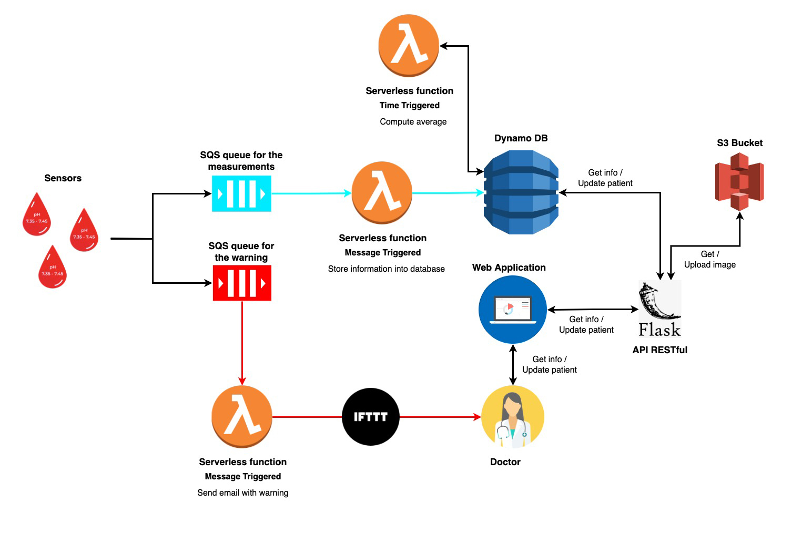

# KetoCare

<p align="center"></p>

This project aims to provide support to doctor to monitor diabetes and prevent diabetic ketoacidosis.

Diabetes is a chronic disease that requires continuous and accurate monitoring of blood sugar levels. A potentially dangerous complication of diabetes, called ketoacidosis, occurs when the organism begins to produce excess ketones leading to an increase of the acidity level in the blood.

The project is based on an IoT Cloud architecture where each sensor (placed on each patient) collects information about blood pH and sends them on where they are processed through Serverless Computing and stored in a NoSQL database.

The sensors' functionality is inspired by the method described in the paper [Bioresorbable Nanostructured Chemical Sensor for Monitoring of pH Level In Vivo](https://onlinelibrary.wiley.com/doi/pdf/10.1002/advs.202202062). The sensor takes pH measurements from `4.0 to 7.45`.

Each sensor sends a message containing the following information:

- sensor ID;
- time in format yyyy-mm-dd hh:mm:ss;
- fiscal code of the patient;
- blood pH value.

Seven measurements are taken per day and the messages are sent on two queues according to the pH value. On the "Measurements" queue all measurements taken are sent, while on the "Warning" queue are sent messages (without specifying the sensor ID) for pH values less than 7.35. 

Each message sent on the "Measurements" queue triggers a Serverless function that is responsible to insert the measurement into a NoSQL database. The "Measurements" table contain items with the following information:
- fiscal code of the patient;
- time in format yyyy-mm-dd hh:mm:ss;
- sensor ID;
- blood pH value.
<p align="center"></p>


At the end of the day, a time triggered Serverless function computes the average of the 7 daily measurements for each patient and saves the result in the "Averages" table. Each item in the table contains the following information:
- fiscal code of the patient;
- time in format yyyy-mm-dd hh:mm:ss;
- blood pH average;
- sensor ID;
- blood pH values.
<p align="center"></p>

Each message sent on the "Warning" queue triggers a Serverless function that sends an email to the doctor notifying him of the warning.
<p align="center"></p>

To the doctor will be provided a web application offering the following functionalities:
1. Display of patient list and information such as age and type of diabetes;
2. Average display for the current and previous day;
3. Display of measurements taken on the current and previous day;
4. Display of average and measurement history.

<p align="center"></p>

The web application consists of a user interface and a set of RESTful APIs defined using the Flask framework. 

The APIs offer the possibility of:

1. obtain all patients in the "Patients" table. Each item in the table contains the following information:
   - fiscal code;
   - first name;
   - surname;
   - date of birth in "DD/MM/YYYY" format;
   - type of diabetes (1 or 2);
   - profile image name;
   
   <p align="center"></p>
   
   The image name is used to retrieve the patient image contained in the S3 "patientsimages" bucket.
    
2. obtain the average of a given patient on a given date;
3. obtain the measurements of a specific patient on a specific date.

## Architecture
<p align="center"></p>

- The Cloud environment is simulated using [LocalStack](https://localstack.cloud/) to replicate the [AWS services](https://aws.amazon.com/).
- The IoT devices are simulated using a Python function exploiting [boto3](https://boto3.amazonaws.com/v1/documentation/api/latest/guide/quickstart.html) to send messages on the queues.
- The queue are implemented using [Amazon Simple Queue Service (SQS)](https://aws.amazon.com/sqs/).
- The database is built using [Amazon DynamoDB](https://aws.amazon.com/dynamodb/).
- The functions are Serveless functions deployed on [AWS Lambda](https://aws.amazon.com/lambda/).
- The time-triggered function is implemented using [Amazon EventBridge](https://aws.amazon.com/eventbridge/).
- The email is sent using [IFTT](https://ifttt.com/).
- The DynamoDB GUI is available using [dynamodb-admin](https://github.com/aaronshaf/dynamodb-admin).
- The patients' images are stored using [Amazon S3](https://aws.amazon.com/it/s3/).
- The APIs are built with [Flask](https://flask.palletsprojects.com/en/2.2.x/quickstart/#).


## Prerequisites
1. [Docker](https://docs.docker.com/get-docker/);
2. [AWS CLI](https://docs.aws.amazon.com/cli/latest/userguide/getting-started-install.html);
3. [boto3](https://boto3.amazonaws.com/v1/documentation/api/latest/guide/quickstart.html);
4. (Optional) nodejs for database visualization.


## Setting up the environment
### 1. Clone the repository

```
git clone https://github.com/BenedettoSimone/KetoCare-Motion.git
```

### 2. Launch [LocalStack](https://localstack.cloud/)

```
docker run --rm -it -p 4566:4566 -p 4571:4571 localstack/localstack
```

### 3. Create a SQS queue for measurements and warnings, and create S3 bucket to store images

```
aws sqs create-queue --queue-name Measurements --endpoint-url=http://localhost:4566
```

```
aws sqs create-queue --queue-name Warning --endpoint-url=http://localhost:4566
```

```
aws s3 mb s3://patientsimages --endpoint-url=http://localhost:4566
```

To check that the queues have been correctly created use the following command.
	
```
aws sqs list-queues --endpoint-url=http://localhost:4566
```

### 4. Create the DynamoDB tables and populate them
	
1) Use the Python code to create the DynamoDB tables
	
```shell
cd KetoCare
```
```
python3 settings/createMeasurementsTable.py
```
```
python3 settings/createAveragesTable.py
```
```
python3 settings/createPatientsTable.py
```
2) Check that the tables have been correctly created

```
aws dynamodb list-tables --endpoint-url=http://localhost:4566
```
	
3) Populate tables with initial data. The `loadData` script loads the measurements and the average of the two days preceding the current day. The `loadPatients` script loads the data of five patients. In addition, the patient's profile photo will be loaded into the S3 bucket.
	
```
python3 settings/loadData.py
```
```
python3 settings/loadPatients.py
```
	
4) Check that the table have been correctly populated using the AWS CLI (*Press q to exit*)

```
aws dynamodb scan --table-name Measurements --endpoint-url=http://localhost:4566
```
	
or using the [dynamodb-admin] GUI with the command
	
```
DYNAMO_ENDPOINT=http://0.0.0.0:4566 dynamodb-admin
```
	
and then going to `http://localhost:8001`.

### 5. Set up the Lambda function triggered by SQS messages that store the measurements

1) Zip the Python file and create the Lambda function
```
aws iam create-role --role-name lambdarole --assume-role-policy-document file://settings/role_policy.json --query 'Role.Arn' --endpoint-url=http://localhost:4566
```
```
aws iam put-role-policy --role-name lambdarole --policy-name lambdapolicy --policy-document file://settings/policy.json --endpoint-url=http://localhost:4566
```
```
zip saveMeasurements.zip settings/saveMeasurements.py
```
```
aws lambda create-function --function-name saveMeasurements --zip-file fileb://saveMeasurements.zip --handler settings/saveMeasurements.lambda_handler --runtime python3.6 --role arn:aws:iam::000000000000:role/lambdarole --endpoint-url=http://localhost:4566
```

2) Create the event source mapping between the function and the queue

```
aws lambda create-event-source-mapping --function-name saveMeasurements --batch-size 5 --maximum-batching-window-in-seconds 60 --event-source-arn arn:aws:sqs:us-east-2:000000000000:Measurements --endpoint-url=http://localhost:4566
```


### 6. Set up the Lambda function triggered by SQS messages that notifies errors in IoT devices via email

1) Create the IFTT Applet
	1. Go to https://ifttt.com/ and sign-up or log-in if you already have an account.
	2. On the main page, click *Create* to create a new applet.
	3. Click "*If This*", type *"webhooks"* in the search bar, and choose the *Webhooks* service.
	4. Select "*Receive a web request*" and write *"email_warning"* in the "*Event Name*" field. Save the event name since it is required to trigger the event. Click *Create trigger*.
	5. In the applet page click *Then That*, type *"email"* in the search bar, and select *Email*.
	6. Click *Send me an email* and fill the fields as follows:
- *Subject*: `[KetoCare] Warning!`
		
- *Body*: `The sensor of patient <b>{{Value1}}</b> reported at <b>{{Value2}}</b> a blood pH value of <b>{{Value3}}</b> .`
	
	7. Click *Create action*, *Continue*, and *Finish*.

2) Modify the variable `key` within the `emailWarning.py` function with your IFTT applet key. The key can be find clicking on the icon of the webhook and clicking on *Documentation*.

3) Zip the Python file and create the Lambda function
```
zip emailWarning.zip settings/emailWarning.py
```
```
aws lambda create-function --function-name emailWarning --zip-file fileb://emailWarning.zip --handler settings/emailWarning.lambda_handler --runtime python3.6 --role arn:aws:iam::000000000000:role/lambdarole --endpoint-url=http://localhost:4566
```

4) Create the event source mapping between the function and the queue

```
aws lambda create-event-source-mapping --function-name emailWarning --batch-size 5 --maximum-batching-window-in-seconds 60 --event-source-arn arn:aws:sqs:us-east-2:000000000000:Warning --endpoint-url=http://localhost:4566
```

5) Test the mapping sending a message on the error queue and check that an email is sent

```
aws sqs send-message --queue-url http://localhost:4566/000000000000/Warning --message-body '{"fiscal_code": "FRRLNZ50M24F839C","measure_date": "2023-02-27 18:57:03", "measured_value": "7.02"}' --endpoint-url=http://localhost:4566
```
